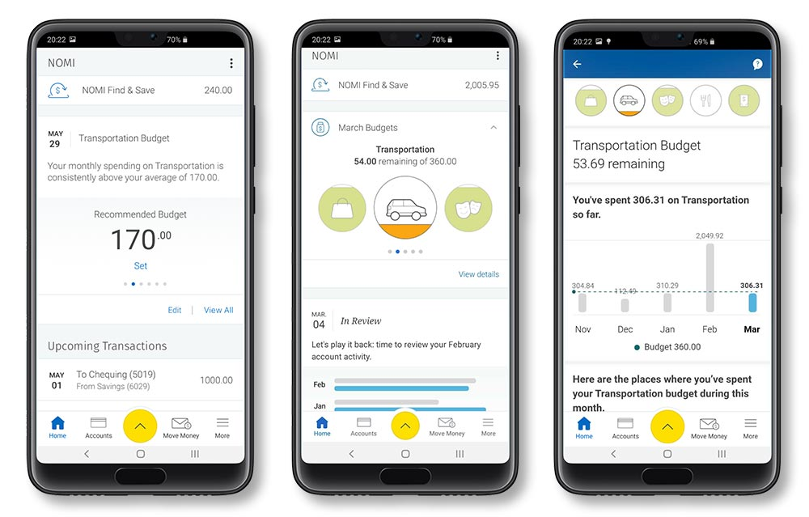

# CASESTUDY: WILL RBC NOMI REPLACE PERSONAL BANKER USING ARTIFICIAL INTELLIGENCE AND PREDICTIVE TECHNOLOGY

## OVERVIEW

Financial Institution:  Royal Bank of Canada [RBC][https://www.rbcroyalbank.com/personal.html] 

Product:                NOMI [NOMI][https://www.rbcroyalbank.com/mobile/feature/nomi/index.html] 

Value addition:         Client engagement with RBC Mobile app, more than
                        170 million insights given, clients save an average of $ 197 per month 

Technology used         AI, Predictive analytics 

* Royal Bank of Canada [TSE:RY][https://g.co/kgs/GnGAV8] is the largest bank in Canada by market capitalization, founded in 1864. With a client base of over 17 million and around 89000 employees around the world, RBC has always been a front runner in introducing digital technology to its clients. Royal Bank of Canada introduced NOMI (pronounced Know-Me), AI powered virtual assistant in the fall of 2017 to offer clients personalised insights and a fully-automated savings service through RBC Mobile app. It was another first to the bank. 

## What is NOMI

NOMI Insights provides relevant, timely and personalized insights to manage day-to-day finances of the clients. NOMI Find and Save, the automated money management system, uses predictive technology and AI to help clients find money they otherwise wouldn't have thought to save and moves it to a savings account automatically, creating a small nest egg.

Along with NOMI Insights and NOMI Find and Save, the bank has further leveraged the AI technology to add more value to its clients by offering NOMI Budgets (giving calculated budget and recommendations on unique spending habits), ASK NOMI(chat bot) and NOMI Forecast (helps manage upcoming expenses, rolling forescast of expenses for the next 7 days). All these services are offered free of charges on the bank's mobile app.

## Will NOMI eliminate the need for a human Personal Banker

* Is NOMI becoming the personal banker we always needed? 

With NOMI on the app, RBC is bringing its customer service on to the digital platform. The banking app doesn't feel transactional anymore. NOMI even moves money from its savings account to the linked chequing account to cover any shortfalls on payments, there by saving clients non-sufficient fund charges and dip in their credit report. NOMI alerts include savings opportunities by identifying payment errors and increase in regular payments, for example, on insurance payment.

## Numbers

* 1.47 million unique users of NOMI toola in June 2021

* Since 2017, NOMI Find & Save has helped clients find and save over CDN \$1.5 billion dollars in total
* Since 2017, clients have read about 1.7 billion insights through NOMI Insights
* Since 2019, over 1.1 million clients have set a budget with NOMI Budgets
* Since 2020, Ask NOMI has answered about 3.5 million questions for clients
* Since its launch in 2017, NOMI has helped RBC clients save an average of $197 per month, has delivered more than 170 million insights
* Client Digital engagement with RBC mobil app amongst NOMI users is 20% higher and the monthly user time is 6% longer in NOMI users on the mobile app

## Technology

NOMI Find and Save and NOMI Insights use AI technology from Isreal's Personetics.
NOMI Forecast was built on Borealis AI’s OpenShift GPU cluster, which is optimized for building large scale machine learning models. 

## Industry use of AI and Predictive Technology

Major Banks in Canada are well on their path of Digitalization and AI is proving as a pivotal fintech innovation. AI was originally used by Canadian banks for fraud detection and management. Now it is being used to enhance customer experience providing personalised financial advice to its clients.

Banks are also using AI and machine learning technologies to strengthen their cybersecurity, prevent financial crimes and enhance their risk management. They also deploy these technologies to assist in their back end operations as well.

Bank of Montreal [TSE: BMO](https://g.co/kgs/hd8wQ6) offers BMO Insights on their mobile app offers a quick personalised picture of day-to-day spending, help spot unusual activity in the account and find real savings.

Toronto-Dominion Bank [TSE: TD](https://g.co/kgs/mRZ1JR) offers customers with intuitive mobile app experiences through AI technology. It has introduced intelligent insights with personalised real-time information that are relevant to the customers' bamking needs.

Scotiabank (Bank of Nova Scotia) [TSE: BNS](https://g.co/kgs/BjkwB1) leveraged it data and analytics technology to engage with financially vulnarable clients during the pandemic. 

ATB Financial, owned by Alberta Provincial government, uses AI to improve their customer experience.

## Challenges of using AI in banking industry

### Investment

Though AI technology is being used in the banking sector in Canada, it is not widespread across the board. Only the top 5% of the banks are using it to add value to their clients. Canada, once a global leader in AI, should invest in AI research, nurturing and retaining talent here. 

### Ethics

The ethical use of AI in customer data is still mired with confusion in Canada withing the highly regulated Banking Sector. Current regulations governing the use of AI in the financial industry is a patchwork of laws or regulations. The federal government and the provincial governments need to step up and address this current situtation.

Eliminating bias, providing transparency and fairness on decisions needs to be addressed.

### Identify vulnerable customers

Banks AI use to identify financial vulnerable customers could be made legal to protect customers from financial burdens. Using AI, banks could proacively talk to clients to keep their credit scores at a good rating.

## Recommendations

Building Trust: Since it is emergencing techology, it is important for financial institutions to thoroughly stress test the technology and introduce AI chat bots who can actually find answers to build the trust in these new tech with its customers.

Expand use of personlised insights on finance and investments to small business to help them with financial management. This would be of great advantage to the business owners, who do not have the time or skill to manage their finances.

Language and context are important to improve the client experience on the digital platforms the AI are using. 

More banks and financial institutions need to invest in actively improving engagement by staying committed to the cause.

## Resources used

source: [https://www.retailbankerinternational.com/news/canadas-major-banks-optimise-ai-to-drive-growth-enhance-customer-experience/] 
source: [https://financialpost.com/sponsored/business-sponsored/rbcs-nomi-uses-artificial-intelligence-to-uncover-real-savings-and-insights-for-clients] 
source: [https://www.bmo.com/main/personal/ways-to-bank/manage-my-money-insights/] 
source: [https://stories.td.com/ca/en/news/2021-12-08-td-empowers-customers-with-new-intuitive-mobile-app-experien] 
source: [https://www.mccarthy.ca/en/insights/blogs/techlex/ai-canadian-financial-services-industry] 
source: [https://www.theglobeandmail.com/business/article-we-dont-go-fast-and-break-things-banks-try-to-manage-risks-as-they/] 
source: [https://www.atb.com/personal/] 
source: [http://www.rbc.com/newsroom/news/2017/20170828-nomi.html] 
source: [https://www.briefings.cba.ca/how-artificial-intelligence-is-redefining-banking]
